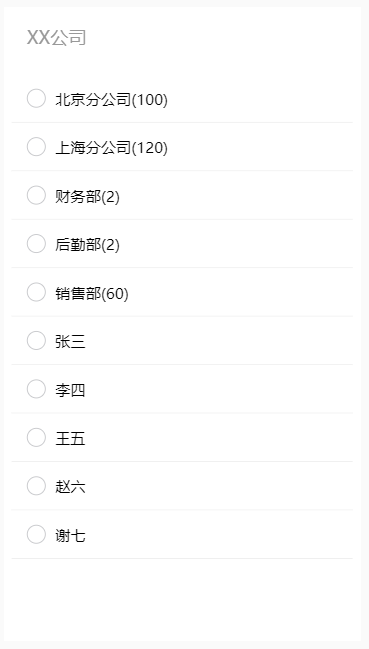

# 移动端树组件

### 介绍

kTree 是一个移动端树组件，可作为企业组织通讯录，课程目录 etc.



## 代码演示

### 基础用法

```js
// main.js
import mTree from 'vue-mobile-tree';
import 'vue-mobile-tree/lib/vue-mobile-tree.css';
Vue.use(mTree);
```

```html
<m-tree
  :data="data"
  :options="options"
  @click="onClick"
  @change="onChange"
  @selected="onSelected"
/>
```

```html
<m-tree
  :data="data"
  :options="options"
  @click="onClick"
  @change="onChange"
  @selected="onSelected"
>
  <template #label="{ node }">
    <span>{{node.title}}</span>
    <span v-if="!node.isLeaf">({{node.origin.count}})</span>
  </template>
</m-tree>
```

```js
data() {
  return {
    options: {},
    data: [
      {
        key: 100001,
        title: 'XX公司',
        parentid: -1,
      },
      {
        key: 100002,
        title: '北京分公司',
        parentid: 100001,
      },
      {
        key: 100003,
        title: '上海分公司',
        parentid: 100001,
      },
      {
        key: 100003100001,
        title: '张三',
        parentid: 100001,
        isLeaf: true
      },
      {
        key: 100001100002,
        title: '李四',
        parentid: 100001,
        isLeaf: true
      },
      {
        key: 100002100001,
        title: '王五',
        parentid: 100002,
        isLeaf: true
      },
    ],
  };
}
```

## API

### Props

| 参数    | 说明     | 类型     | 默认值                      |
| ------- | -------- | -------- | --------------------------- |
| data    | 原始数据 | _Array_  | `[]`                        |
| options | 配置信息 | _Object_ | `{default: [], rootId: -1}` |

### Events

| 事件名   | 说明                  | 回调参数     |
| -------- | --------------------- | ------------ |
| click    | 点击右侧 Label 时触发 | event: Event |
| change   | 状态改变时触发        | event: Event |
| selected | 选中列表改变          | event: Event |

### Slots

| 名称  | 说明            |
| ----- | --------------- |
| label | 右侧 Title 区域 |
