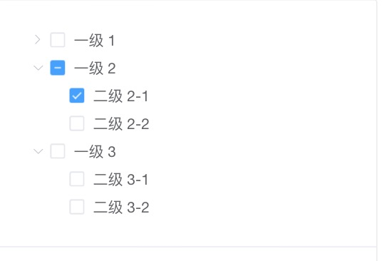
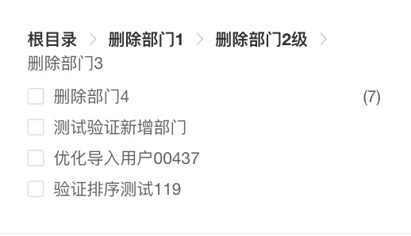

# vs-tree

一个基于 vue 的 通用tree组件，支持层级面包屑、虚拟滚动、懒加载、最大可选，复选框...


## 浏览器支持

 |  |  |  | 
--- | --- | --- | --- | --- |
Latest ✔ | Latest ✔ | Latest ✔ | Latest ✔ | Latest ✔ |

## 功能点

* [x] 基础树组件
* [x] 层级面包屑
* [x] 复选框
* [x] 异步加载数据/报错处理
* [x] 虚拟列表
* [x] 最大可选

## 基于el-tree新增扩展

  简单易用同时满足pc和移动端的Tree结构需求：
  详情见: [使用说明](./examples/docs/tree.md).

### PC Tree
  

### 面包屑
  

### 安装

依赖库：[vue](https://www.npmjs.com/package/vue) 2.5+

```shell
npm install vs-tree
```

或

```shell
yarn add vs-tree
```

### 使用

  ```js
  import VsTree from 'vs-tree';
  import 'vs-tree/lib/style/index.css';

  Vue.use(VsTree);
  ```

  ```html
  <vs-tree :data="data"></vs-tree>
  ```

  ```js
  export default {
    data() {
      return {
        data: [
          {label: 'demo1', children: [
            {label: 'demo11'}
          ]},
          {label: 'demo2'}
        ]
      };
    }
  }
  ```

> 项目基于: [el-tree](https://element.eleme.cn/#/zh-CN/component/tree); 虚拟列表: [vue-virtual-scroll-list](https://github.com/tangbc/vue-virtual-scroll-list);